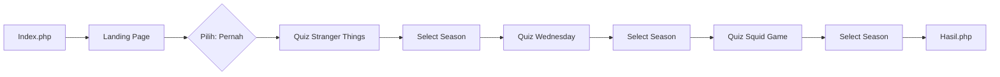
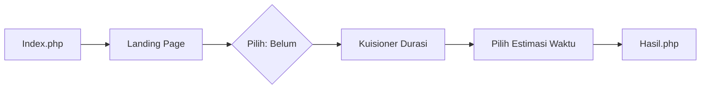

# 🎬 Nitflix - DetikBahagia Quiz Platform

<div align="center">
  
  
  **Interactive Netflix-themed Quiz Platform untuk Mengukur Kebiasaan Menonton**
  
  [](https://www.php.net/)
  [](https://tailwindcss.com/)
  [](LICENSE)
</div>

---

## 📋 Deskripsi Project

**Nitflix** adalah platform kuisioner interaktif dengan tema Netflix yang dirancang untuk menganalisis kebiasaan menonton pengguna terhadap series populer seperti **Stranger Things**, **Wednesday**, dan **Squid Game**. Platform ini menggunakan sistem kategorisasi berbasis usia dan durasi menonton untuk memberikan insight personalisasi kepada setiap pengguna.

### ✨ Fitur Utama

- 🎯 **Kuisioner Multi-Series**: Quiz untuk 3 series Netflix populer
- 👥 **Kategorisasi Usia**: Remaja (12-19), Dewasa Muda (20-30), Dewasa (31-70)
- ⏱️ **Estimasi Durasi Dinamis**: Perhitungan otomatis berdasarkan kategori usia
- 📊 **Hasil Personalisasi**: 5 kategori intensitas (Sangat Ringan - Sangat Berat)
- 🎨 **UI Netflix-Style**: Desain responsif dengan nuansa Netflix authentic
- 📱 **Fully Responsive**: Optimal untuk Desktop, Tablet, dan Mobile
- 🔄 **Loading Effects**: Smooth transitions dan animasi loading
- 💾 **Session Management**: Data tersimpan di PHP session dengan logging

---

## 🚀 Demo

### Landing Page


### Kuisioner Durasi


### Halaman Hasil


---

## 🛠️ Tech Stack

### Frontend
- **Tailwind CSS v3.x** - Utility-first CSS framework
- **Vanilla JavaScript** - Form handling & animations
- **Google Fonts** - Netflix Sans font family

### Backend
- **PHP 7.4+** - Server-side logic
- **Session Management** - State persistence
- **File Logging** - Activity tracking

### Design
- **Netflix Design System** - Color palette & typography
- **Responsive Design** - Mobile-first approach
- **CSS Animations** - Smooth transitions & effects

---

## 📁 Struktur Project

```
DetikBahagia/
├── assets/
│   ├── css/
│   │   └── netflix-enhanced.css
│   ├── images/
│   │   ├── logo nitflix.png
│   │   ├── logo n.png
│   │   ├── Stranger Things Banner.png
│   │   ├── Wednesday banner.png
│   │   └── Squid Game Banner.png
│   └── js/
│       └── netflix-enhanced.js
├── includes/
│   ├── process_form.php          # Proses data user
│   ├── save_choice.php            # Save pilihan Pernah/Belum
│   ├── save-quiz.php              # Save jawaban quiz per series
│   └── save-duration.php          # Save data durasi menonton
├── pages/
│   ├── landing-stranger-things.php
│   ├── landing-wednesday.php
│   ├── landing-squid-game.php
│   ├── quiz-stranger-things.php
│   ├── quiz-stranger-things-season.php
│   ├── quiz-wednesday.php
│   ├── quiz-wednesday-season.php
│   ├── quiz-squid-game.php
│   ├── quiz-squid-game-season.php
│   ├── kuisioner-durasi.php       # Kuisioner untuk user "Belum"
│   └── hasil.php                  # Result page
├── logs/
│   ├── submissions.log
│   ├── choices.log
│   ├── quiz-answers.log
│   └── duration-quiz.log
├── index.php                      # Entry point
├── landing_page.php               # Main landing page
├── FLOW_KUISIONER.md
├── DOKUMENTASI_KUISIONER_DURASI.md
└── README.md
```

---

## 📊 Flow Diagram

### User Journey - "Pernah Nonton"


### User Journey - "Belum Nonton"


---

## 🎯 Sistem Kategorisasi

### Range Berdasarkan Usia

#### 👦 Remaja (12-19 tahun)
| Kategori | Jam/Minggu | Jam/Hari | Warna |
|----------|-----------|----------|-------|
| 🟢 Sangat Ringan | < 7.1 | < 1.0 | Green |
| 🔵 Ringan | 7.1 - 14.2 | 1.0 - 2.0 | Teal |
| 🟠 Sedang | 14.2 - 21.3 | 2.0 - 3.0 | Orange |
| 🔴 Berat | 21.3 - 28.4 | 3.0 - 4.1 | Red |
| 🔴 Sangat Berat | > 28.4 | > 4.1 | Dark Red |

#### 👨 Dewasa Muda & Dewasa (20-70 tahun)
| Kategori | Jam/Minggu | Jam/Hari | Warna |
|----------|-----------|----------|-------|
| 🟢 Sangat Ringan | < 14.2 | < 2.0 | Green |
| 🔵 Ringan | 14.2 - 28.4 | 2.0 - 4.1 | Teal |
| 🟠 Sedang | 28.4 - 42.6 | 4.1 - 6.1 | Orange |
| 🔴 Berat | 42.6 - 56.8 | 6.1 - 8.1 | Red |
| 🔴 Sangat Berat | > 56.8 | > 8.1 | Dark Red |

---

## 💻 Instalasi

### Prerequisites
- PHP 7.4 atau lebih tinggi
- Web server (Apache/Nginx)
- Browser modern (Chrome, Firefox, Safari, Edge)

### Langkah Instalasi

1. **Clone Repository**
   ```bash
   git clone https://github.com/jouleee/DetikBahagia.git
   cd DetikBahagia
   ```

2. **Setup Web Server**
   
   **Untuk XAMPP/WAMP:**
   ```bash
   # Copy folder ke htdocs/www
   cp -r DetikBahagia C:/xampp/htdocs/
   ```
   
   **Untuk PHP Built-in Server:**
   ```bash
   php -S localhost:8000
   ```

3. **Buat Folder Logs (opsional)**
   ```bash
   mkdir logs
   chmod 755 logs
   ```

4. **Akses Aplikasi**
   ```
   http://localhost/DetikBahagia/
   # atau
   http://localhost:8000/
   ```

---

## 🎨 Design System

### Color Palette
```css
--netflix-red: #E50914;
--netflix-dark: #141414;
--netflix-black: #000000;
--netflix-gray: #333333;

/* Category Colors */
--green: #10B981;     /* Sangat Ringan */
--teal: #14B8A6;      /* Ringan */
--orange: #F59E0B;    /* Sedang */
--red: #EF4444;       /* Berat */
--dark-red: #DC2626;  /* Sangat Berat */
```

### Typography
- **Font Family**: Netflix Sans (via Google Fonts)
- **Weights**: 400, 500, 700, 800, 900

### Responsive Breakpoints
```css
sm: 640px    /* Mobile landscape, small tablets */
md: 768px    /* Tablets */
lg: 1024px   /* Desktop */
xl: 1280px   /* Large desktop */
2xl: 1536px  /* Extra large desktop */
```

---

## 📝 API Endpoints

### POST `/includes/process_form.php`
Proses data user dari form awal
```json
{
  "nama": "John Doe",
  "usia": "remaja"
}
```

### POST `/includes/save_choice.php`
Save pilihan Pernah/Belum
```json
{
  "choice": "belum",
  "skip_quiz": true,
  "timestamp": "2024-01-15T10:30:00Z"
}
```

### POST `/includes/save-quiz.php`
Save jawaban quiz per series
```json
{
  "film": "stranger-things",
  "question": "season",
  "answer": "4"
}
```

### POST `/includes/save-duration.php`
Save estimasi durasi menonton
```json
{
  "daily_hours": 2.0,
  "weekly_hours": 14.2,
  "total_minutes": 852,
  "category": "B"
}
```

---

## 🔧 Konfigurasi

### Session Data Structure
```php
$_SESSION['user_data'] = [
    'nama' => 'John Doe',
    'usia' => 'remaja',
    'usia_label' => 'REMAJA 12 - 19 Tahun',
    'usia_kategori' => 'Remaja',
    'timestamp' => '2024-01-15 10:30:00'
];

$_SESSION['quiz_data'] = [
    'stranger-things' => [
        'watched' => 'pernah',
        'season' => 4,
        'duration' => 2096
    ],
    'wednesday' => [...],
    'squid-game' => [...],
    'total_duration' => 3500
];
```

---

## 🧪 Testing

### Test Scenarios

#### ✅ Test Case 1: Shortcut - Klik "Belum"
```
Landing Page → Klik "Belum" → Kuisioner Durasi → Hasil
```

#### ✅ Test Case 2: Semua "Pernah"
```
Landing Page → Quiz ST (Season 4) → Quiz W (Season 2) → Quiz SG (Season 2) → Hasil
```

#### ✅ Test Case 3: Mixed
```
Landing Page → Quiz ST (Pernah) → Quiz W (Belum) → Quiz SG (Belum) → Hasil
```

---

## 📈 Logging

Semua aktivitas user dicatat di folder `/logs/`:

- **submissions.log** - Data user yang submit form
- **choices.log** - Pilihan Pernah/Belum
- **quiz-answers.log** - Jawaban per series
- **duration-quiz.log** - Estimasi durasi menonton

Format log:
```
[2024-01-15 10:30:22] User: John Doe | Film: stranger-things | Answer: pernah | Duration: 2096 min
```

---

## 🤝 Contributing

Contributions are welcome! Silakan ikuti langkah berikut:

1. Fork repository ini
2. Buat branch baru (`git checkout -b feature/AmazingFeature`)
3. Commit perubahan (`git commit -m 'Add some AmazingFeature'`)
4. Push ke branch (`git push origin feature/AmazingFeature`)
5. Buat Pull Request

---

## 📄 License

Distributed under the MIT License. See `LICENSE` for more information.

---

## 👥 Team

**DetikBahagia Team**

- Project Lead: [Your Name]
- Developer: [Your Name]
- Designer: [Your Name]

---

## 🙏 Acknowledgments

- Netflix untuk inspirasi design
- Tailwind CSS untuk framework CSS
- Google Fonts untuk Netflix Sans font
- Stranger Things, Wednesday, Squid Game untuk konten series

---

## 📞 Contact

Project Link: [https://github.com/jouleee/DetikBahagia](https://github.com/jouleee/DetikBahagia)

---

<div align="center">
  Made with ❤️ by DetikBahagia Team
  
  ⭐ Star this repo if you find it helpful!
</div>